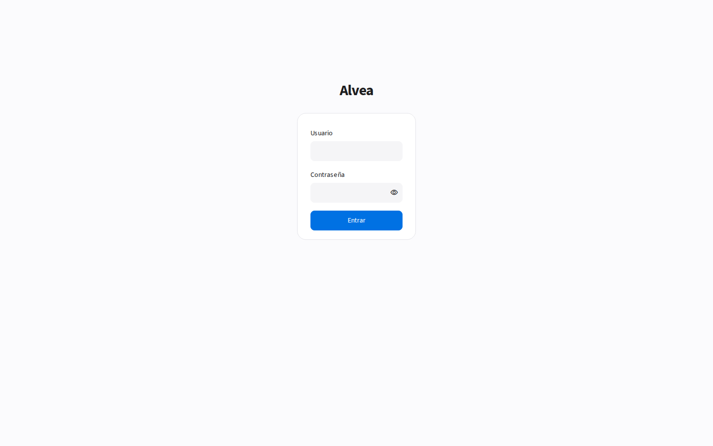
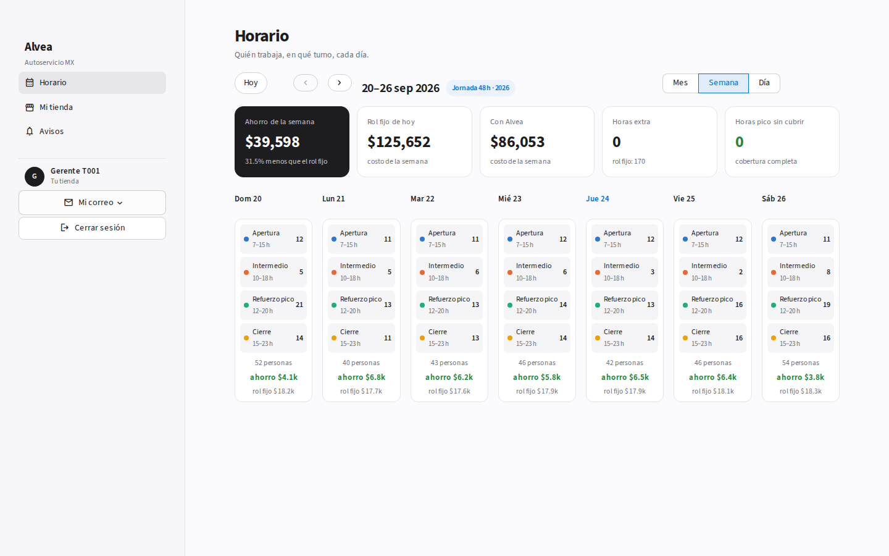
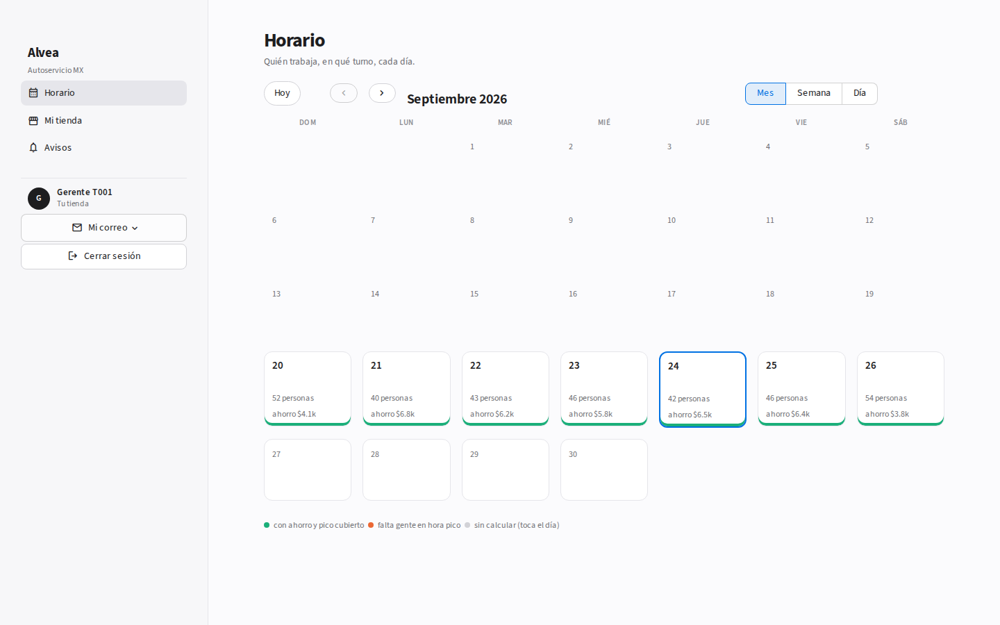
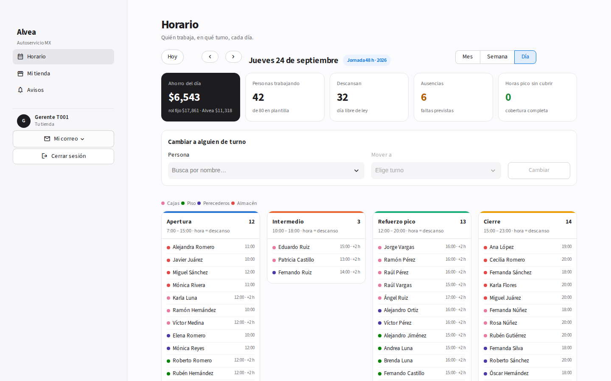
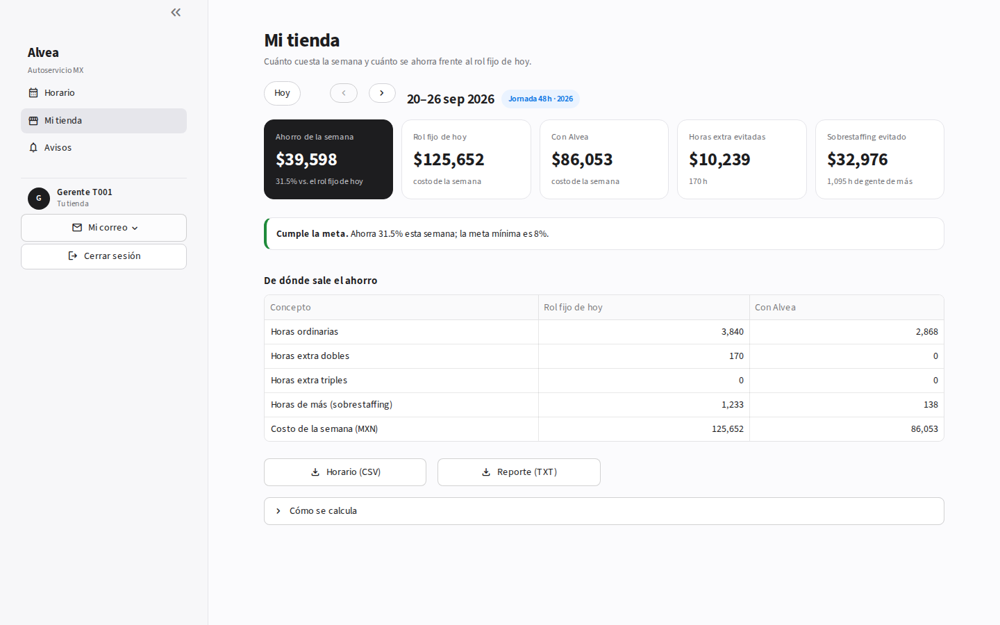
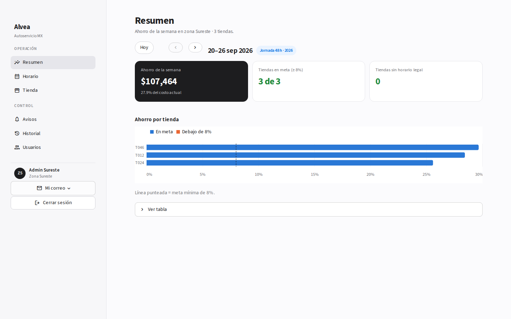

# Alvea PMV — Autoservicio MX

PMV para el reto técnico de ALVENA/AIvena (Head of Product and Technology):
una herramienta que arma el horario semanal de personal para 50 tiendas
de un autoservicio genérico ("Autoservicio MX", marca ficticia, datos
100% sintéticos), respeta la jornada legal mexicana (incluida la reforma
de 40 horas, DOF 01-05-2026) y cuantifica en pesos el ahorro frente a
cómo se programaría hoy.

## Acceso / credenciales de login

La app pide iniciar sesión: usuario + contraseña, como cualquier login
(no hay que elegir un rol aparte — el nombre de usuario ya dice a qué rol
y, si aplica, a qué tienda pertenece). La contraseña es la misma para
todos.

**Contraseña (para cualquier usuario):** `3.14159265358`

| Usuario | Quién es |
| --- | --- |
| `SADMIN` | Super Admin — ve todo, puede "ver como" cualquier perfil sin volver a loguearse |
| `ADMIN-Z1` .. `ADMIN-Z5` | Admin regional — una cuenta por zona (CDMX, Occidente, Noreste, Centro, Sureste), ve/gestiona solo las tiendas de su zona |
| `Man001` .. `Man050` | Gerente de tienda — numerado en el mismo orden que el catálogo (Man001 = primera tienda, etc.); solo ve su tienda |

Cada tienda tiene un único usuario de gerente (no hay cuentas de respaldo).
Las 5 zonas de Admin agrupan los 10 clústeres geográficos del catálogo de
tiendas (ver `jornada40/usuarios.py::ZONAS` — es un supuesto de producto,
ajustable). Los admins regionales y sus tiendas se activan/desactivan desde
"Usuarios" (rol Admin o SAdmin; un admin regional solo ve/gestiona
su propia zona).

La contraseña son los primeros dígitos de π, elegidos justo por ser un
valor público y fácil de compartir con quien revise la herramienta — no es
un secreto real (ver `jornada40/usuarios.py` para el detalle de seguridad
aceptado en este PMV).

## Cómo correrla con Docker

```bash
docker build -t jornada40 .
docker run -p 8501:8501 jornada40
```

Abre `http://localhost:8501`. Los datos sintéticos se generan solos
(por semana, al abrirla) — no hay pasos manuales adicionales.

> Nota: este Dockerfile se construyó siguiendo la práctica estándar y se
> verificó ejecutando la app directamente con Python en este entorno
> (ver "Verificación rápida" abajo), pero no se pudo correr `docker build`
> en la sandbox donde se desarrolló (sin demonio Docker disponible).
> Verifícalo en tu máquina antes de la demo.

## Cómo correrla sin Docker

```bash
python3 -m venv venv
source venv/bin/activate
pip install -r requirements.txt
streamlit run app.py
```

## Capturas

| | |
| --- | --- |
|  |  |
|  |  |
|  |  |

Comparación punto por punto contra el PDF del reto: [`docs/comparacion_pdf.md`](docs/comparacion_pdf.md).

## Estructura del repo

```
jornada40/
  reglas.py            Motor de reglas legales por vigencia (48 h en 2026 -> 40 h en 2030)
  datos_sinteticos.py  Dataset sintético: 50 tiendas, plantilla fija y datos por semana bajo demanda
  demanda_personal.py  Tráfico/ventas -> personas requeridas (Erlang C + carga/productividad + calibración)
  escenario_base.py    Horario base: rol fijo rotativo + horas extra (cómo se programa hoy)
  optimizador.py       CP-SAT (OR-Tools): cada persona, cada día -> 1 de 4 turnos fijos o descanso
  costos_ahorro.py     Ahorro semanal, brecha vs. techo, trazabilidad legal, calificación de cambios manuales
  calendario.py        Funciones puras de fechas (mes/semana)
  vista_red.py         Consolidado de tiendas (Resumen)
  usuarios.py          Cuentas (SADMIN / ADMIN-Z1..Z5 / Man001..Man050)
  auditoria.py         Historial de acciones
  notificaciones.py    Avisos en la app + correo SMTP
  simulacros.py        (sin interfaz desde 24-sep-2026; se conserva con sus pruebas)
  tests/               pruebas unitarias (pytest)
app.py                 Interfaz Streamlit
docs/
  manual.md            Manual de uso de TODA la app + checklist de verificación
  guion_demo.md        Guion de 45 min para la demo
  registro_agentic.md  Registro de uso de herramientas agénticas
```

## Cómo funciona (resumen)

- **Menú por rol.** Gerente: Horario, Mi tienda, Avisos. Admin de zona:
  Resumen, Horario, Tienda, Avisos, Historial, Usuarios. Super Admin:
  lo mismo + Reglas legales, Datos y "Ver como".
- **El horario empieza hoy y llega a diciembre de 2030.** El régimen
  legal sale solo de la fecha de cada semana (48 h en 2026, 46 en 2027,
  44 en 2028, 42 en 2029, 40 en 2030). Si una semana cruza de año, aplica
  el tope del año nuevo (el más estricto).
- **Turnos fijos.** Cada tienda tiene 4 turnos de 8 h (Apertura,
  Intermedio, Refuerzo pico, Cierre). El optimizador decide quién entra a
  cuál turno cada día (o descansa) y a qué hora toma cada quien su
  descanso (4.ª–6.ª hora), para que ningún turno se vacíe en hora pico.
- **Un rol por vista.** Horario = operación; Mi tienda / Resumen = dinero.
  Solo el gerente cambia turnos; admin y HQ ven el horario en lectura.
- **Se calcula al abrir.** Abrir una semana (en Horario o Mi tienda) la
  calcula; no hay botón escondido. Los datos de cada semana se generan
  bajo demanda y son reproducibles.
- **Cambios manuales.** En la vista Día: persona -> nuevo turno ->
  Cambiar. Se bloquea si rompe la ley (7 días seguidos o más horas que el
  máximo legal) y si no, se califica contra el óptimo (costo y cobertura
  en pico). Se puede deshacer.

Detalle completo en [`docs/manual.md`](docs/manual.md).

## Supuestos clave (y de dónde salen)

- **Retailer de referencia**: autoservicio genérico (perfil tipo súper/híper
  mediano), 50 tiendas × 80 FTE cada una, domingo a sábado.
- **Calibración de demanda** (`demanda_personal.py`): tiempo de atención en
  caja (Erlang C), factores de carga por ticket y productividad por rol —
  todos en `CONFIG` al inicio del archivo, marcados como **SUPUESTOS —
  CALIBRAR CON DATOS REALES EN FASE 1**.
- **Datos sintéticos** (`datos_sinteticos.py`): tasas de conversión, ticket
  promedio, rangos salariales y multiplicadores de temporada, en `CONFIG`.
- **Valor hora**: `salario_diario / (jornada_horas_semana_vigente / 6)` —
  a menor jornada legal, mayor valor hora (no se puede bajar el salario
  semanal, Transitorio 7 del Decreto).
- **Candado anti-trampa**: si la propuesta deja subdotación nueva que el
  base no tenía, esas horas se penalizan y se restan del ahorro reportado
  (`costos_ahorro.py`, multiplicador 3x documentado como convención de
  negocio del PMV, no cifra legal).

**Calibración (resuelta 24-sep-2026)**: la demanda que sale del tráfico
sintético solo captura trabajo ligado a tickets y era 30–55% de la
capacidad de 80 FTE, por eso el ahorro salía en 50–70% (irreal). Ahora
`demanda_personal.CONFIG["factor_calibracion"]` escala la demanda por
rol y formato bajo un supuesto explícito: **la plantilla actual opera al
60% de su capacidad a 48 h en una semana promedio** (se probó 85% y la
tienda se quedaba sin gente en la apertura). Con descansos escalonados
por persona, turnos extendibles 2 h y el optimizador en dos pasos, el
resultado con las 50 tiendas es 29% de ahorro en la red en 2026 (50/50
tiendas ≥ 8%, 0 horas pico sin cubrir) y ~20% en 2030.

## Pendiente de validación legal

De la tabla de trazabilidad (`costos_ahorro.armar_tabla_trazabilidad()`):

- **Art. 68 LFT** (tramo de tiempo extra al triple, hasta 4h semanales
  adicionales al tope del doble): la lectura conjunta de los arts. 66/68
  reformados es una interpretación adoptada para el PMV, documentada en
  `jornada40/reglas.py` y `jornada40/reglas_README.md` — debe validarla
  un abogado laboral contra el texto exacto del Decreto DOF 01-05-2026.

Todo lo demás en la tabla (jornada ordinaria por año, jornada diaria,
descansos, prima dominical, días festivos) está verificado contra el
texto del decreto y la LFT vigente.

## Fuera de alcance del PMV

- Traslado físico de personal entre tiendas como decisión legal (la
  herramienta propone préstamos dentro del mismo clúster; el acuerdo con
  la persona trabajadora y la aprobación son responsabilidad del cliente).
- Integración con nómina real y con el registro electrónico de jornada
  (art. 132 fr. XXXIV) — el PMV solo exporta CSV.
- Pronóstico de demanda con machine learning (el dataset es sintético con
  semilla fija).
- Día de jornada electoral del art. 74 fr. IX (depende de un calendario
  electoral externo).
- Turnos nocturnos/mixtos (7 / 7.5 h): el catálogo usa turnos de 8 h
  (tope diurno).
- Editar el catálogo de turnos por tienda desde la interfaz (hoy se
  deriva del horario de la tienda).
- Simulacros de escenario y préstamo de personal entre tiendas: el código
  existe (`simulacros.py`), pero se quitó de la interfaz para mantenerla
  enfocada.

## Nota de rendimiento

Cada tienda-semana es un modelo CP-SAT de ~80 personas × 7 días × 4
turnos (unos 2,200 booleanos): tarda de 1 a 25 s según la tienda. En
Resumen, calcular las 50 tiendas de una semana toma varios minutos; el
resultado queda en caché, así que abrir después cualquiera de esas
tiendas es instantáneo. Recomendación: calcular la semana de la demo
antes de la llamada.

## Cómo correr las pruebas

```bash
pip install -r requirements.txt
pytest jornada40/tests/ -v
```

96 pruebas, todas pasando.

## Verificación rápida

Sin Docker, para confirmar que la app arranca sin errores:

```bash
pip install -r requirements.txt
streamlit run app.py --server.headless true &
sleep 5 && curl -s -o /dev/null -w "%{http_code}\n" http://localhost:8501
```

Debe regresar `200`. Para verificar que no hay excepciones de Python al
cargar cada pantalla (más confiable que el curl anterior, que solo prueba
que el servidor responde):

```python
from streamlit.testing.v1 import AppTest
at = AppTest.from_file("app.py", default_timeout=120)
at.run()
assert not at.exception
```
