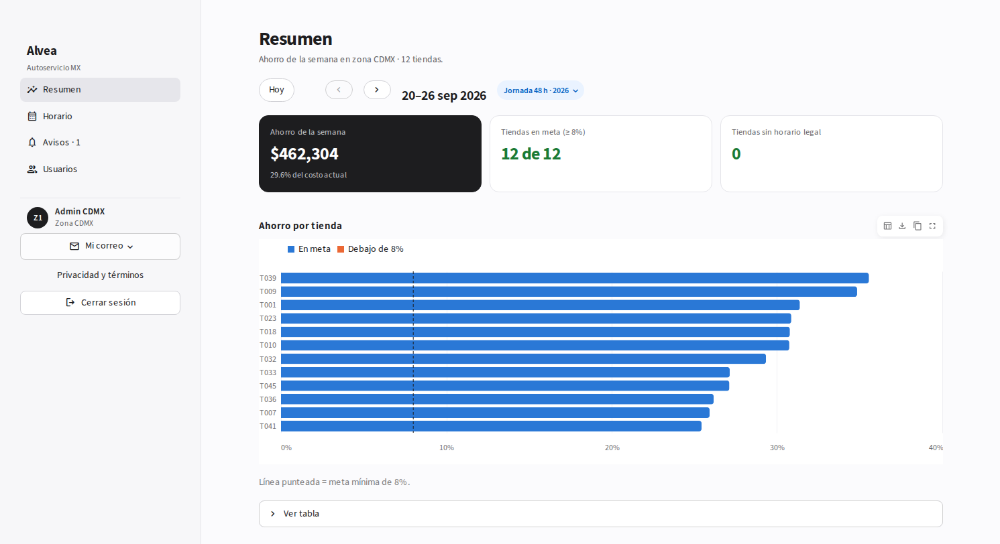
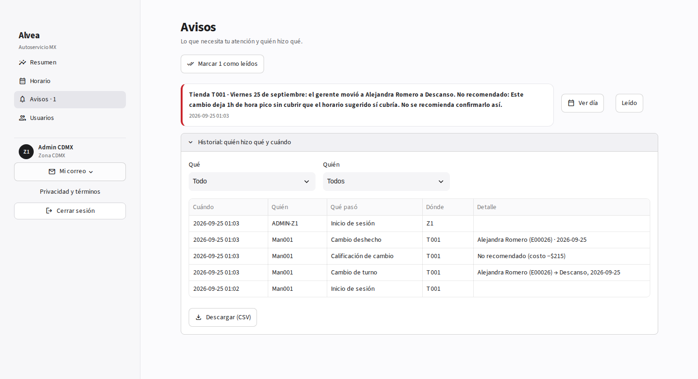
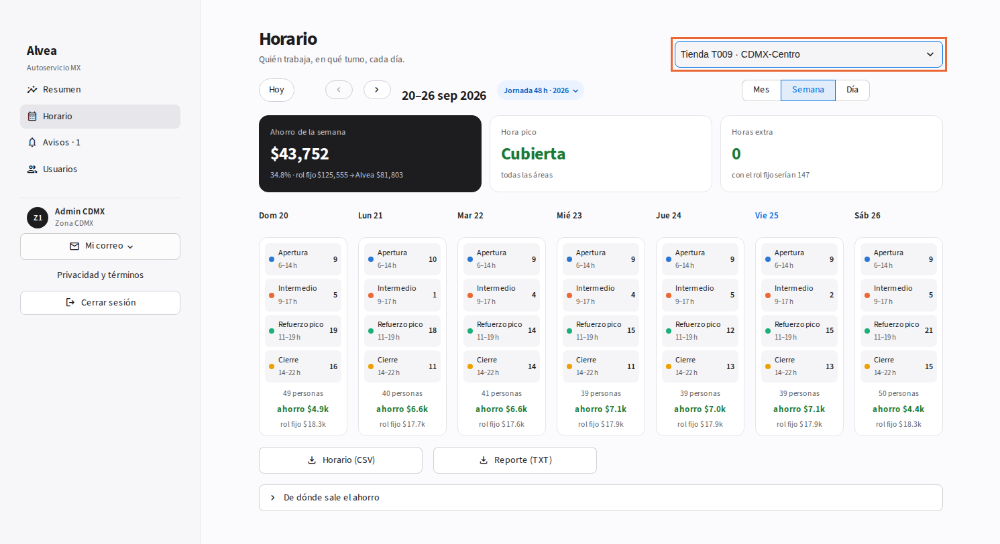
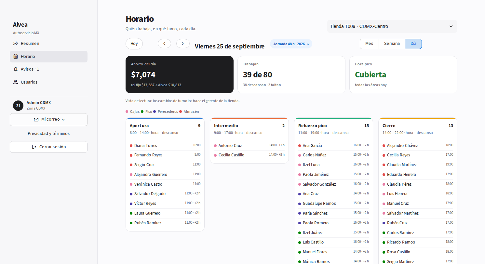
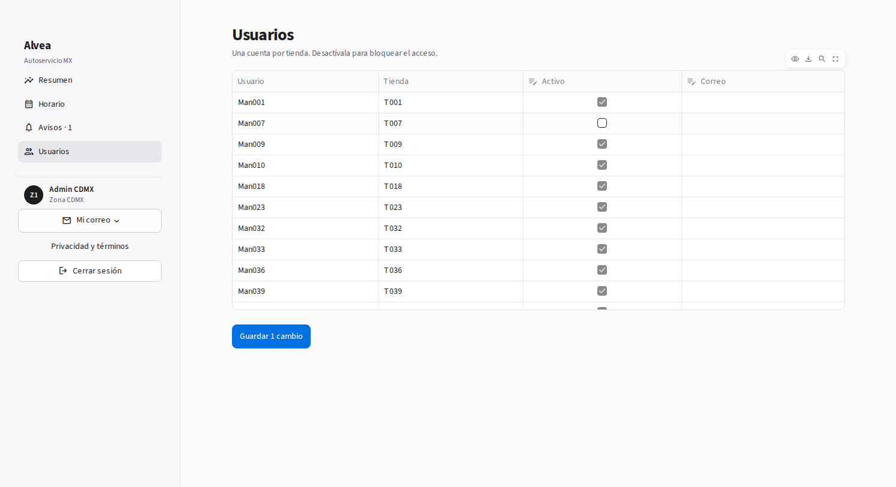

# Tutorial · Admin de zona

**Tu trabajo en Alvea:** vigilar que las tiendas de tu zona ahorren sin dejar la hora pico sin gente, y controlar quién entra.
No cambias turnos (eso es del gerente). Tienes cuatro páginas: **Resumen**, **Horario**, **Avisos** y **Usuarios**. Usuario: `ADMIN-Z1` … `ADMIN-Z5`.

---

## 1. Resumen de tu zona

Ahorro de la semana de toda tu zona, cuántas tiendas llegan a la meta (≥ 8%) y cuántas no tienen horario legal.
La gráfica ordena las tiendas por ahorro; la línea punteada es la meta. Las que no llegan salen en naranja.

## 2. Avisos e historial

Aquí llegan los cambios que un gerente hizo y Alvea no recomienda (por ejemplo, dejar 1 h de pico sin cubrir). **Ver día** te lleva directo a ese día de esa tienda; **Leído** lo quita de pendientes.

Abajo, plegado, **Historial**: quién hizo qué y cuándo en tus tiendas (hora de México). Filtra por **Qué** o **Quién** y descárgalo en CSV.

## 3. Horario de cualquier tienda

En **Horario**, elige la tienda arriba a la derecha. Ves lo mismo que su gerente: semana (con el detalle del ahorro y las descargas), día y mes.

En **Día** es vista de lectura: los cambios los hace el gerente.

## 4. Usuarios

Una cuenta por tienda. Quita la palomita de **Activo** para bloquear el acceso, o escribe el **Correo** para avisos → **Guardar**.
El gerente recibe un aviso de que su cuenta cambió.

