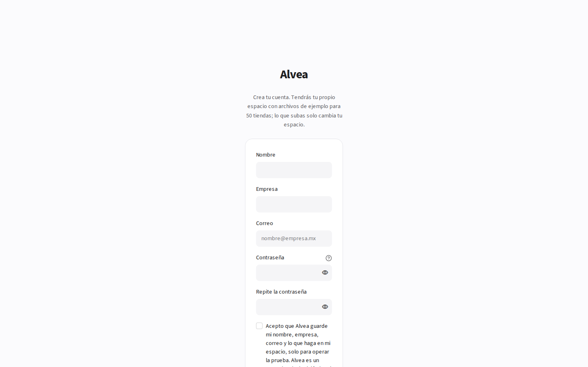
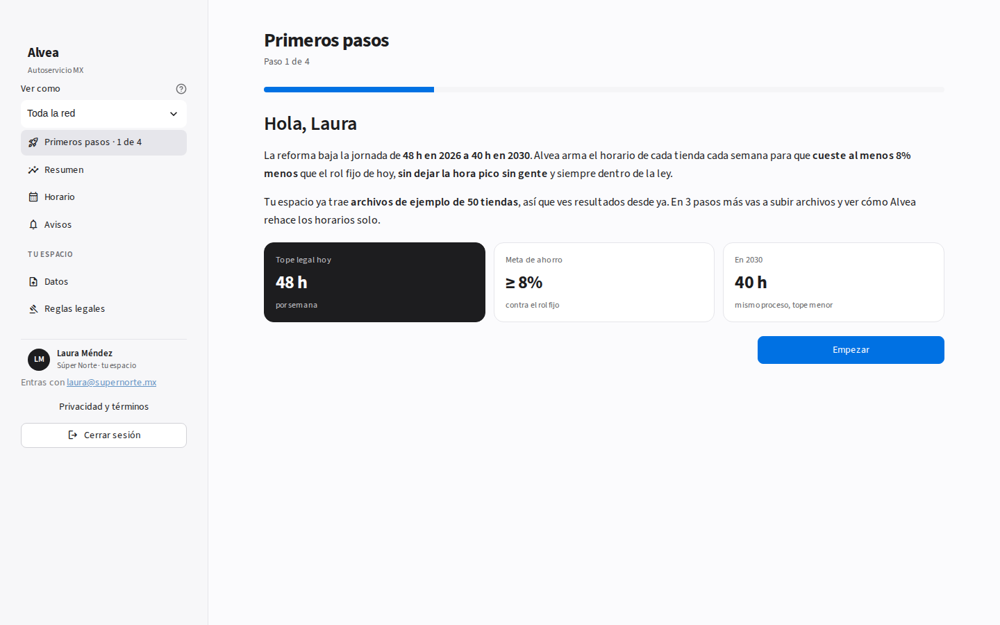
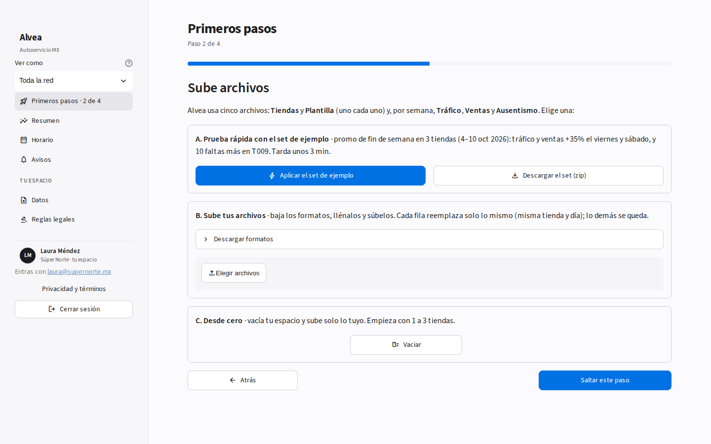
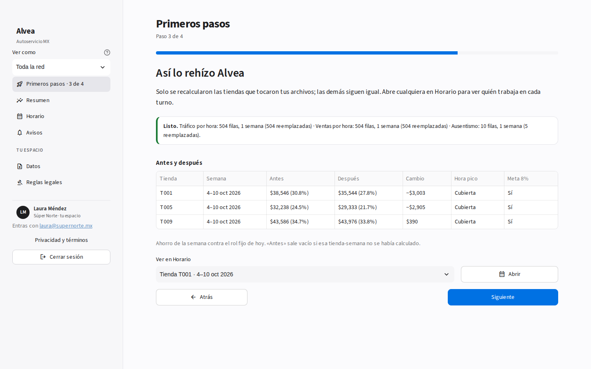
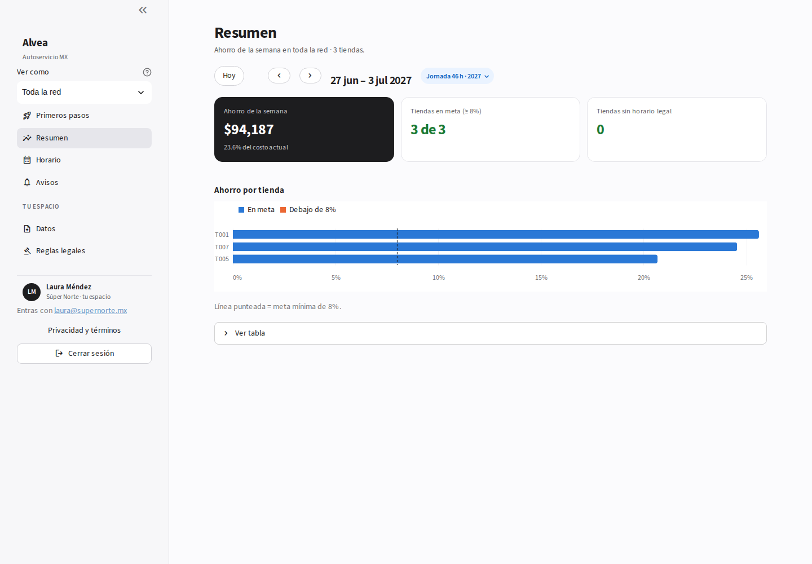

# Tutorial · Tu propia cuenta

**Para quién:** cualquiera que quiera probar Alvea solo, con sus archivos, sin tocar la demo de nadie.

## 1. Crea tu cuenta

En el login toca **¿Primera vez? Crea tu cuenta**: nombre, empresa, correo y contraseña (8 caracteres o más). Entras directo a tu espacio.

## 2. Primeros pasos (4 pasos)

1. **Bienvenida**: qué hace Alvea. Tu espacio ya trae archivos de ejemplo de 50 tiendas.
2. **Sube archivos**, de tres formas:
   - con el set de ejemplo, en un clic;
   - con tus archivos, usando los formatos que se descargan ahí mismo;
   - **desde cero**: tocas **Vaciar** y subes solo lo tuyo.
3. **Antes y después**: Alvea recalcula solo las tiendas que tocaron tus archivos y te muestra el ahorro, si la hora pico quedó cubierta y si llega a la meta de 8%. **Abrir** te lleva a esa tienda en Horario.
4. **Qué sigue**: Resumen, Horario, Datos y Reglas legales.

## 3. Empresa desde cero

En **Datos → Vaciar** quitas los archivos de ejemplo. Sube tus 5 archivos (Tiendas, Plantilla, Tráfico, Ventas y Ausentismo) juntos. Alvea calcula la primera semana de cada tienda. El resto se calcula al abrirlo, o todo un mes a la vez con **Horario → Mes → Calcular el mes**.

**Volver a los archivos de ejemplo** deja tu espacio como empezó.

Para probar hay dos sets listos en `archivos_para_subir/`. El más completo es `tres_meses_jul_sep_2027`: 3 tiendas y 14 semanas.
