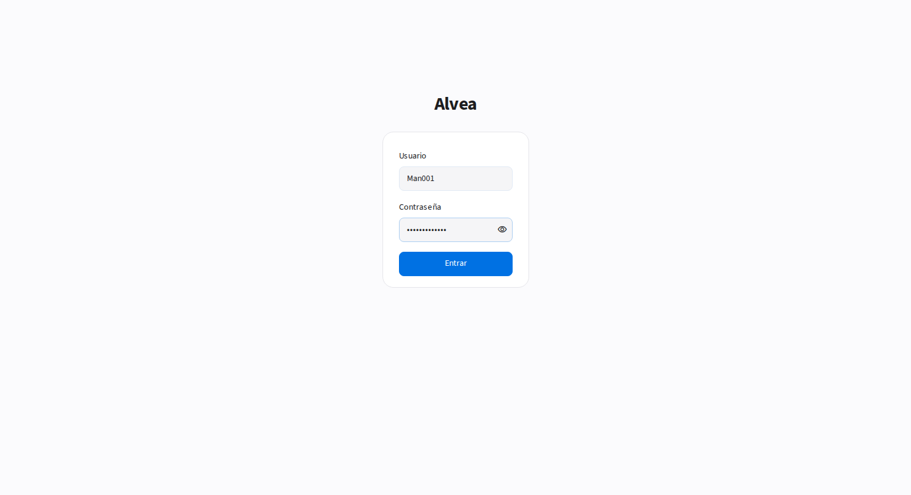
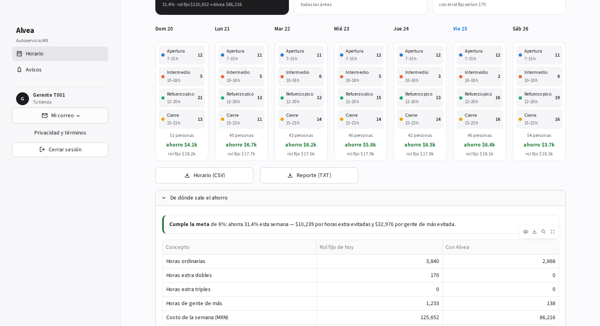
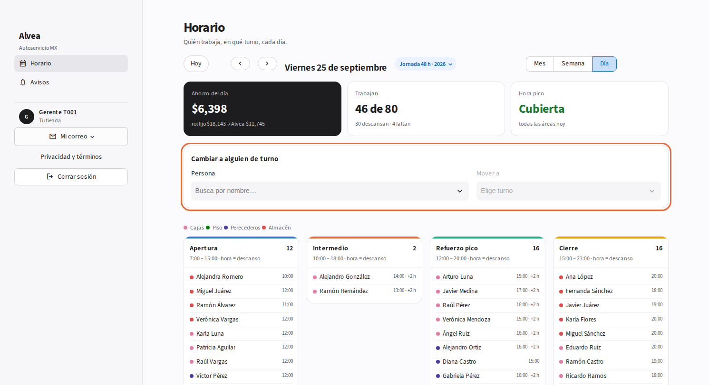
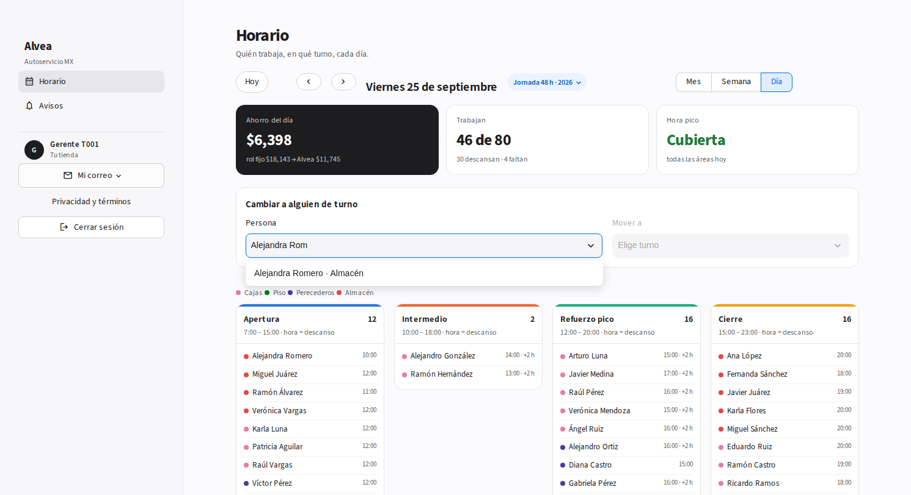
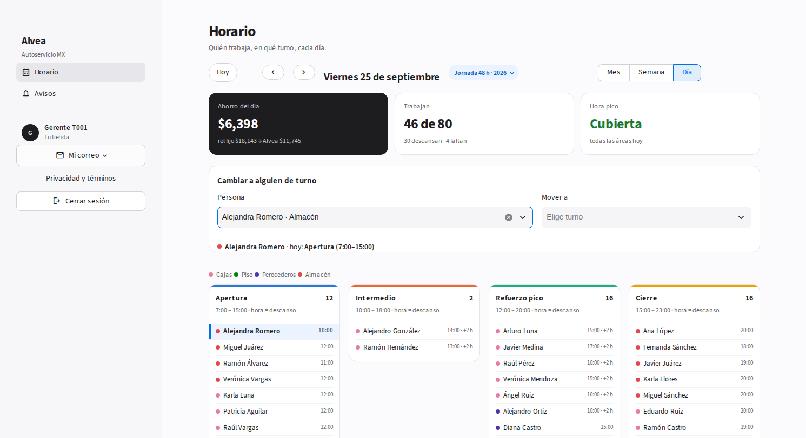
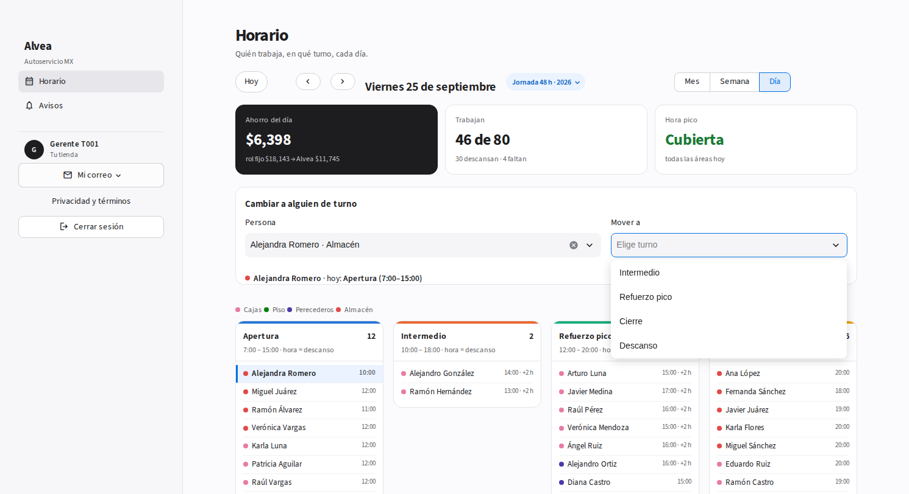
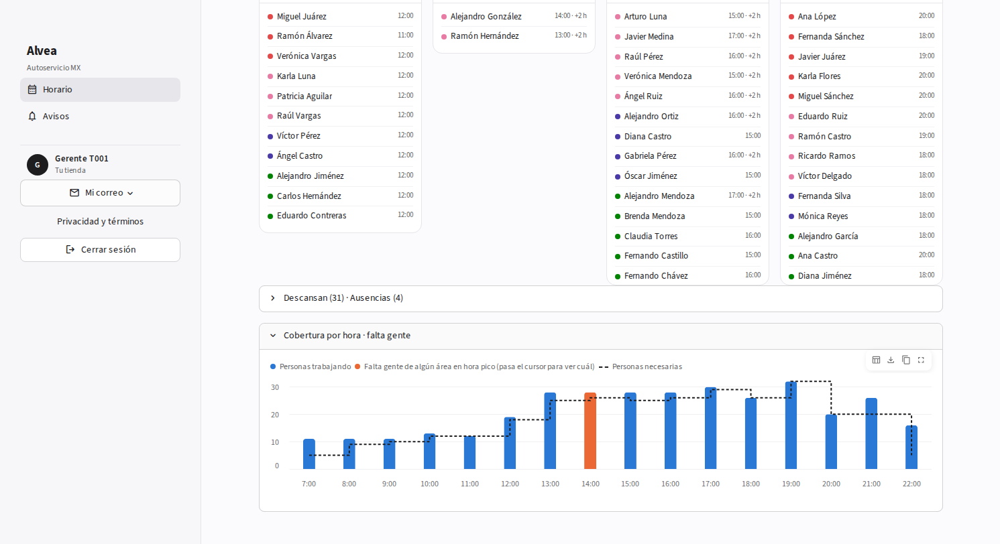
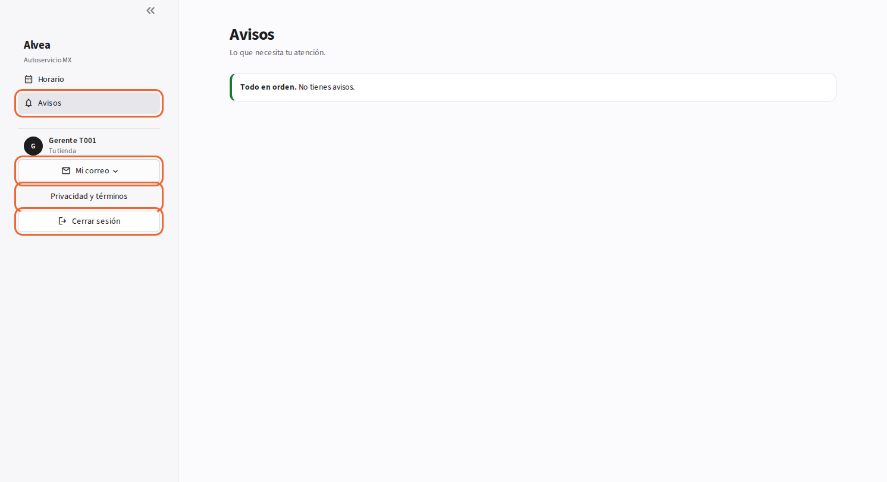

# Tutorial · Gerente de tienda

**Tu trabajo en Alvea:** revisar el horario de tu tienda, hacer los cambios del día y saber cuánto ahorras. Tienes dos páginas: **Horario** y **Avisos**.
Solo ves tu tienda. Usuario: `Man001` … `Man050` (Man001 = tienda T001).

---

## 1. Entra

Escribe tu usuario y la contraseña → **Entrar**.

## 2. Mira la semana

Abres en **Horario → Semana**. Arriba, tres cifras:

- **Ahorro de la semana**, con las dos bases: lo que cuesta el rol fijo de hoy → lo que cuesta con Alvea.
- **Hora pico**: *Cubierta* o cuántas horas falta gente.
- **Horas extra** con Alvea, y cuántas serían con el rol fijo.

Cada día muestra cuántas personas van en cada turno y su ahorro. **Hoy** te regresa a la semana actual; **‹ ›** cambian de semana. Toca **Jornada 48 h · 2026** para saltar a otro año de la reforma (hasta 40 h en 2030).

Abajo: **Horario (CSV)** para imprimir o subir a nómina, **Reporte (TXT)** para mandar por correo y, plegado, **De dónde sale el ahorro** (horas extra evitadas y gente de más evitada, en pesos).

## 3. Abre el día

Toca **Día**. Arriba: ahorro del día, cuántos trabajan (y cuántos descansan o faltan) y si la hora pico está cubierta. Abajo, quién trabaja en cada uno de los 4 turnos, su hora de descanso y quién hace **+2 h**.
El color del punto es el área: cajas, piso, perecederos, almacén.

## 4. Cambia a alguien de turno

1. En **Persona**, busca por nombre.

   

2. Alvea te dice dónde está hoy y la marca en la lista.

   

3. En **Mover a** solo aparecen los turnos donde *no* está (o Descanso). Al elegirlo, el cambio se aplica.

   

4. Alvea califica el cambio al instante. Si deja la hora pico sin gente, dice **No recomendado** y avisa a tu admin de zona. Puedes **Deshacer**.

   

Si falta gente, se abre sola la gráfica **Cobertura por hora**, con la hora en naranja.

## 5. Mira el mes

**Mes** te da cada día con personas y ahorro. La franja de color abajo dice cómo va el día: verde = bien, naranja = falta gente en pico, amarillo = más caro que el rol fijo.

## 6. Avisos y salida

- **Avisos**: lo que necesita tu atención.
- **Mi correo**: a dónde te llegan los avisos. **Privacidad y términos**: qué datos guarda Alvea. **Cerrar sesión** al terminar.

