# Tutorial · Gerente de tienda

**Tu trabajo en Alvea:** revisar el horario de tu tienda, hacer los cambios del día y saber cuánto ahorras.
Solo ves tu tienda. Usuario: `Man001` … `Man050` (Man001 = tienda T001).

---

## 1. Entra

Escribe tu usuario y la contraseña → **Entrar**.

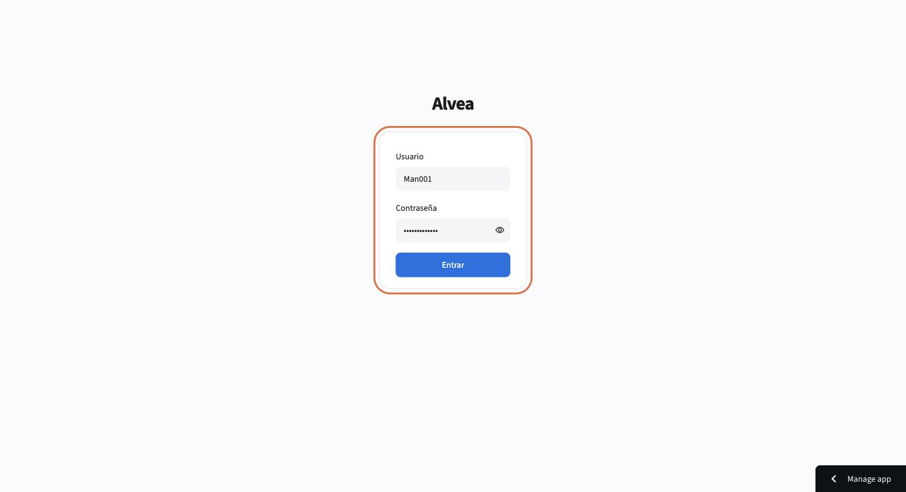

## 2. Mira la semana

Abres en **Horario → Semana**. Arriba, lo que importa:

- **Ahorro de la semana** contra el **rol fijo de hoy** (lo que costaría la semana como se programa hoy).
- **Horas extra** (con Alvea vs. rol fijo) y **Horas pico sin cubrir** (debe estar en 0).

Cada día muestra cuántas personas van en cada turno, el ahorro del día y el costo del rol fijo.
**Hoy** te regresa a la semana actual; **‹ ›** cambian de semana.

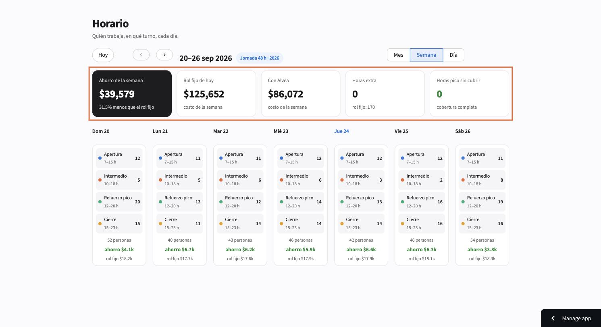

## 3. Abre el día

Toca **Día**. Ves quién trabaja en cada uno de los 4 turnos, la hora de descanso de cada persona y quién hace **+2 h**.
El color del punto es el área: cajas, piso, perecederos, almacén.

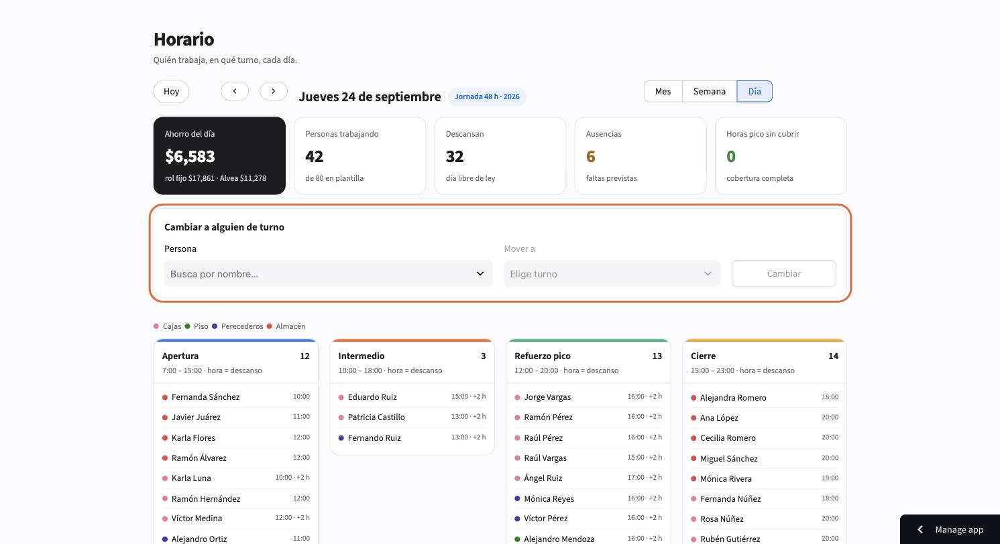

## 4. Cambia a alguien de turno

1. En **Persona**, busca por nombre.

   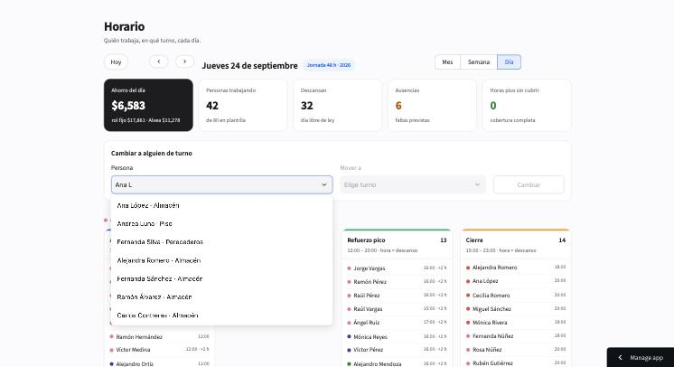

2. Alvea te dice dónde está hoy y la marca en la lista.

   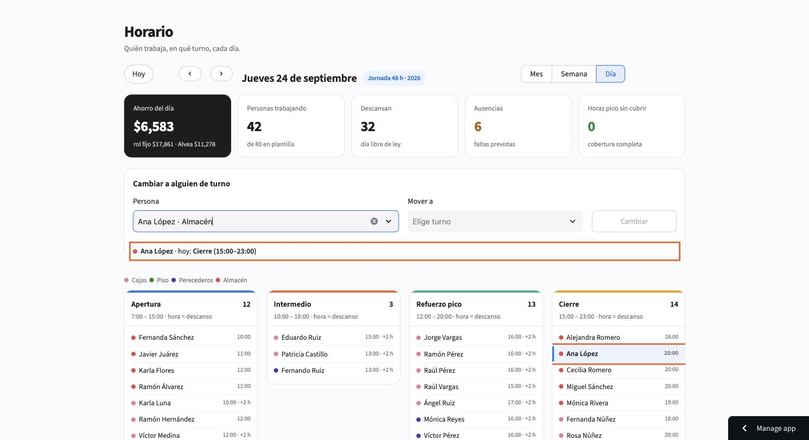

3. En **Mover a** solo aparecen los turnos donde *no* está (o Descanso).

   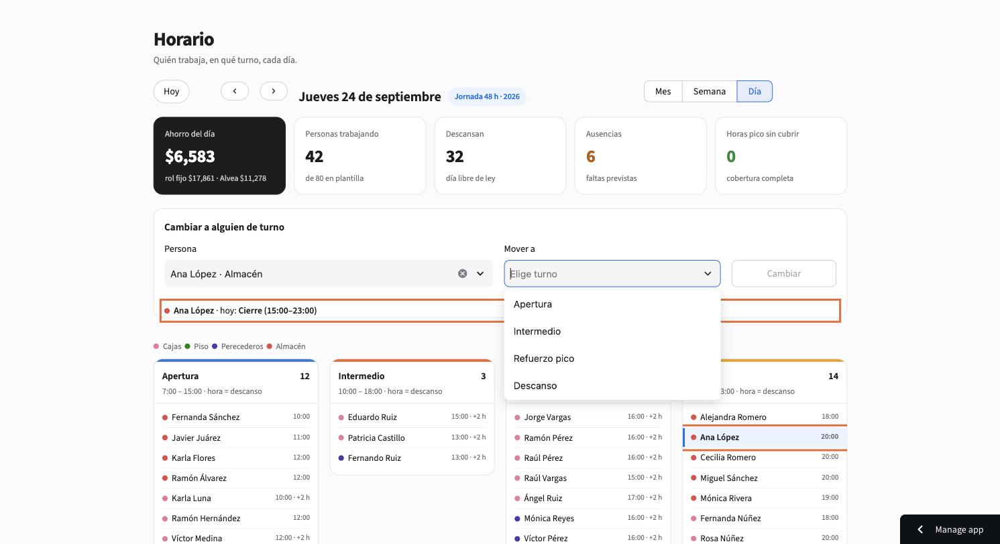

4. **Cambiar**. Alvea califica el cambio al instante. Si deja la hora pico sin gente, dice **No recomendado** y avisa a tu admin de zona. Puedes **Deshacer**.

   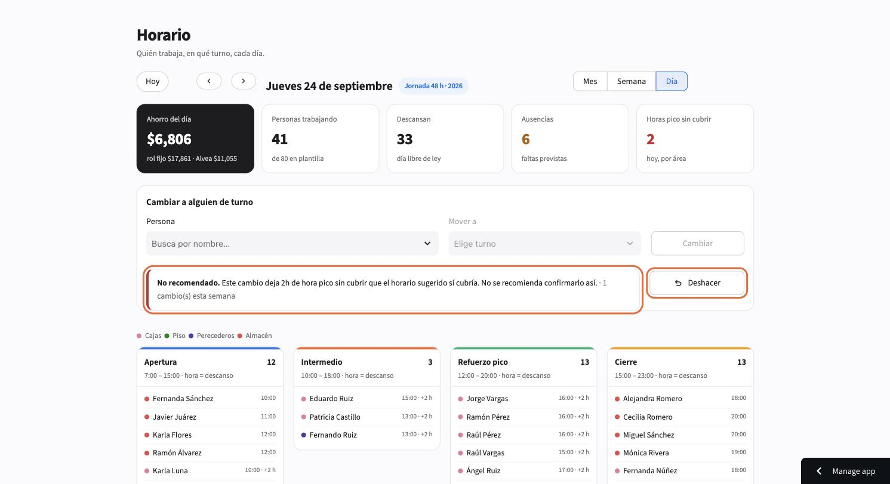

La gráfica de cobertura marca en naranja las horas donde falta gente.

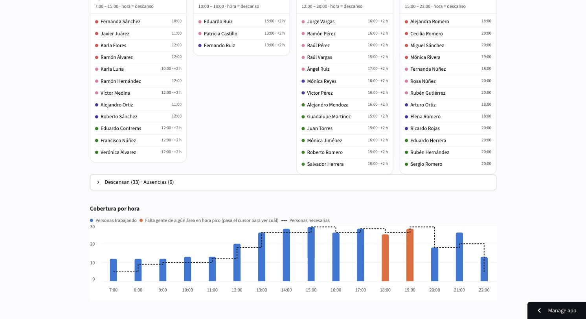

## 5. Mira el mes

**Mes** te da cada día con personas y ahorro. La franja de color abajo dice cómo va el día: verde = bien, naranja = falta gente en pico, amarillo = más caro que el rol fijo.

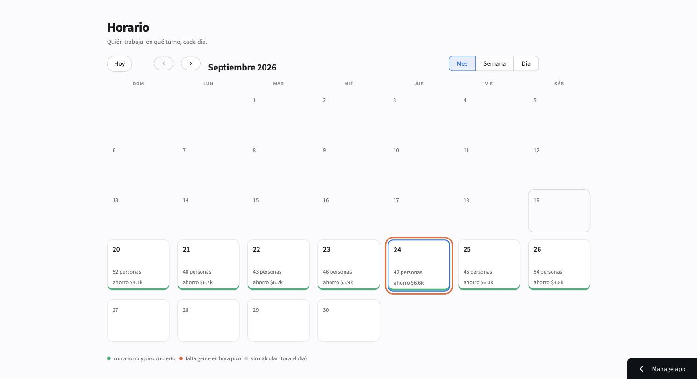

## 6. Mi tienda: cuánto ahorras

Costo de la semana con Alvea contra el rol fijo, de dónde sale el ahorro (horas extra evitadas y sobrestaffing evitado) y si cumples la meta de 8%.

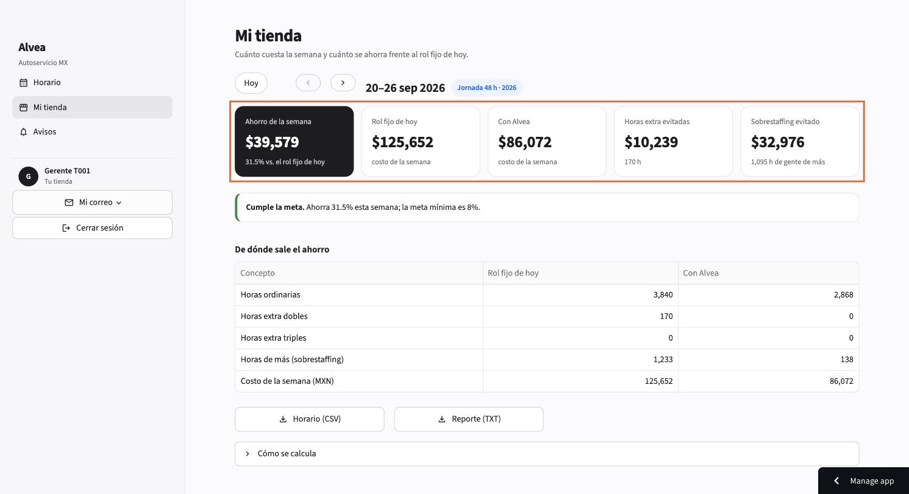

## 7. Descarga, avisos y salida

- **Horario (CSV)** para imprimir o subir a nómina; **Reporte (TXT)** para mandar por correo.
- **Avisos**: lo que necesita tu atención.
- **Mi correo**: a dónde te llegan los avisos. **Cerrar sesión** al terminar.

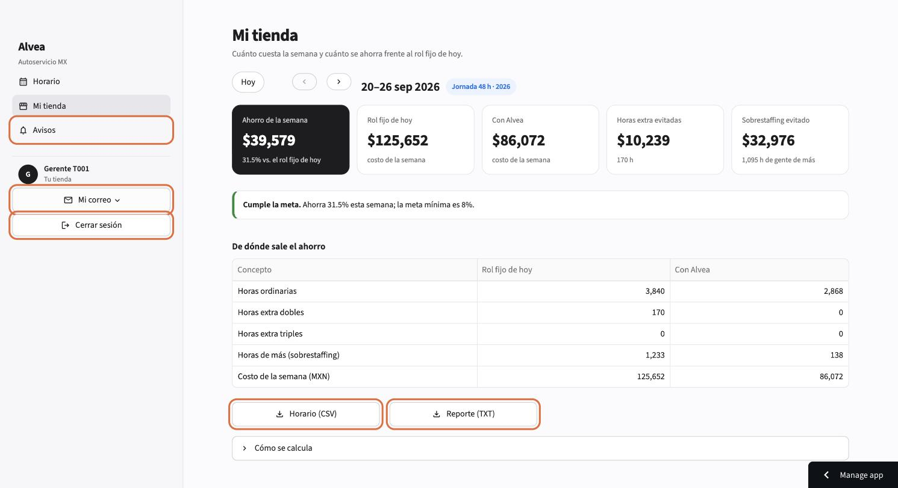
