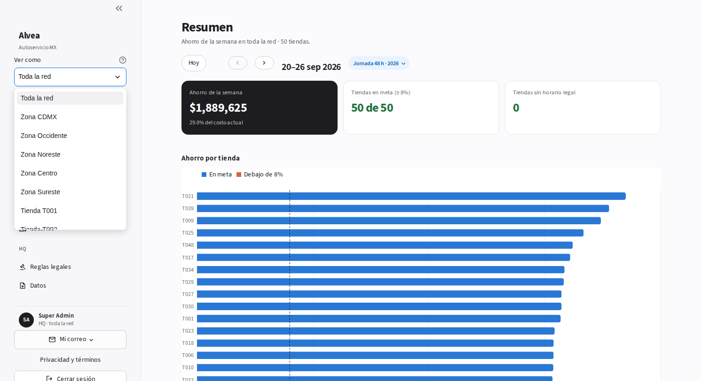
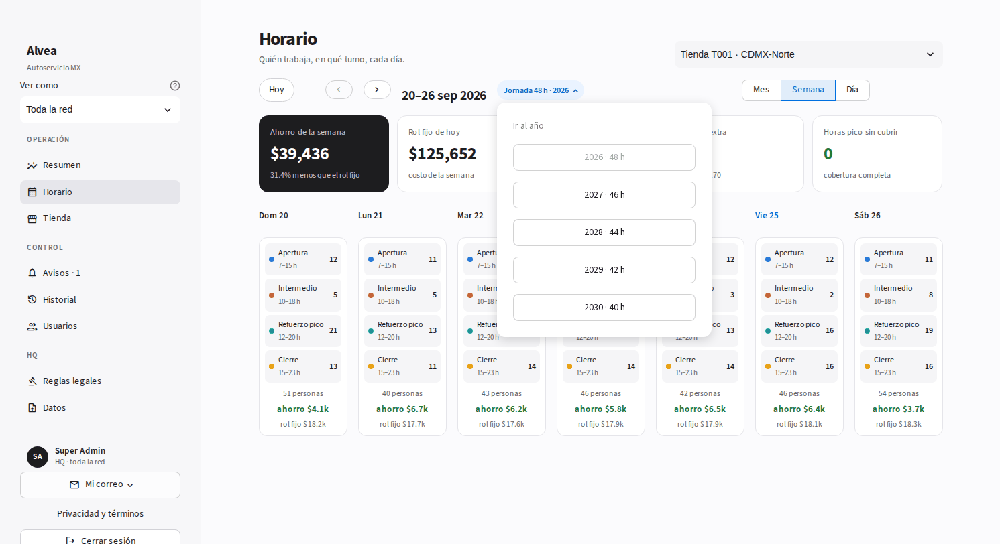
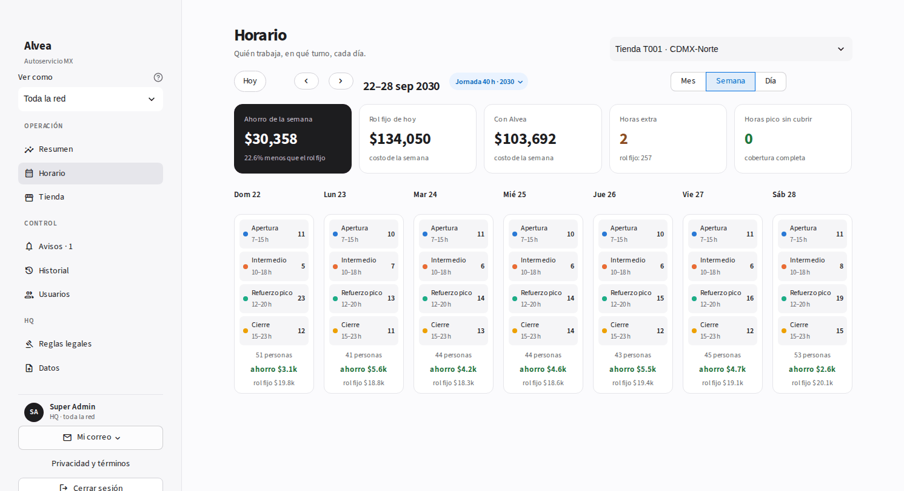
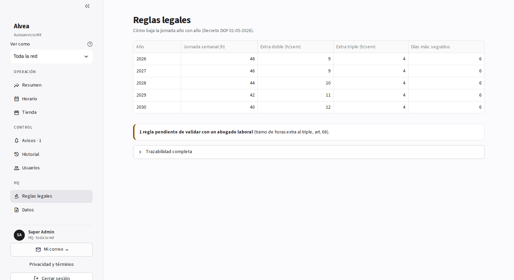
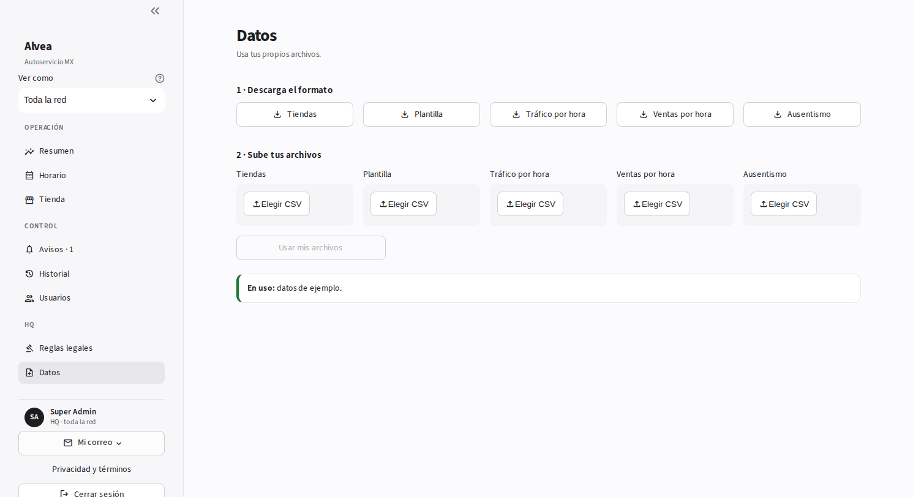

# Tutorial · Super Admin (HQ)

**Tu trabajo en Alvea:** ver la red completa, revisar las reglas de ley año por año y cargar datos nuevos.
Tienes todo lo del admin de zona, para las 50 tiendas, más **Ver como**, **Reglas legales** y **Datos**. Usuario: `SADMIN`.

---

## 1. Resumen de la red

Ahorro de la semana de las 50 tiendas, tiendas en meta y tiendas sin horario legal.

## 2. Ver como

Arriba del menú, **Ver como** te deja ver la app como una zona o una tienda, sin volver a entrar.

## 3. Salta a otro año de la reforma

La pastilla **Jornada 48 h · 2026** también es un botón: tócala y elige el año. Alvea abre la misma fecha de ese año con su tope de horas.

En 2030 el tope ya es 40 h y la tienda sigue sin dejar horas pico sin cubrir. Las semanas de la demo (2026 y 2030) vienen precalculadas: el Resumen de las 50 tiendas abre al instante (2030: 21.7% de ahorro, 50 de 50 en meta).

## 4. Reglas legales

Cómo baja la jornada de 2026 a 2030, los topes de horas extra y la regla que falta validar con un abogado. **Trazabilidad completa** liga cada regla con el Decreto.

## 5. Datos

1. Descarga el formato de cada archivo.
2. Súbelo lleno con **Elegir CSV**.
3. **Usar mis archivos**: Alvea recalcula todo sola.

Abajo dice qué datos están en uso.

